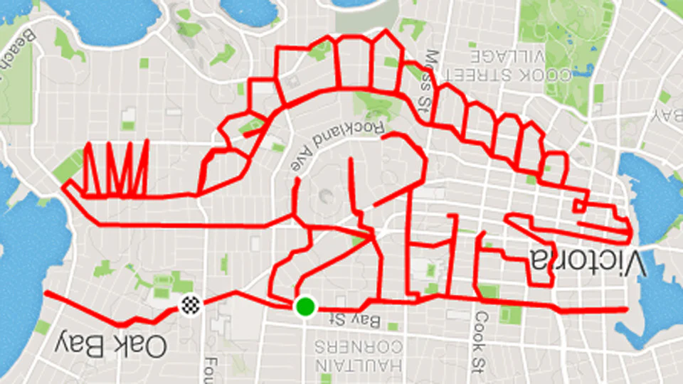
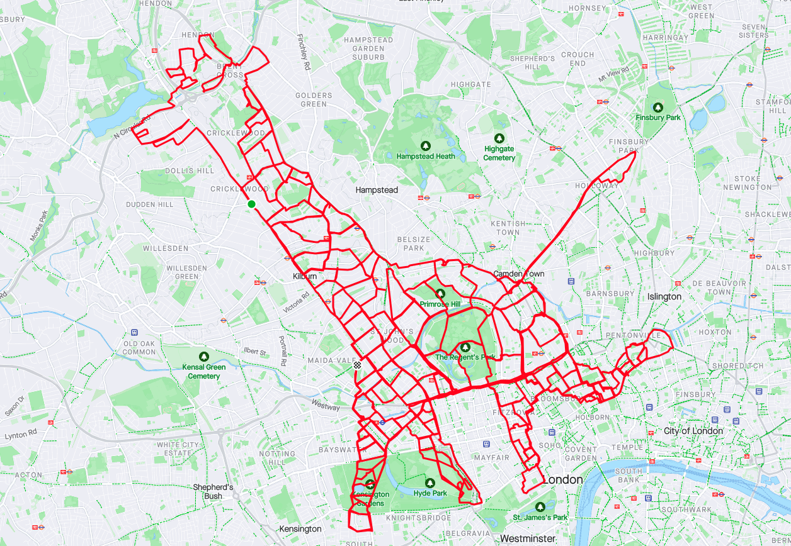
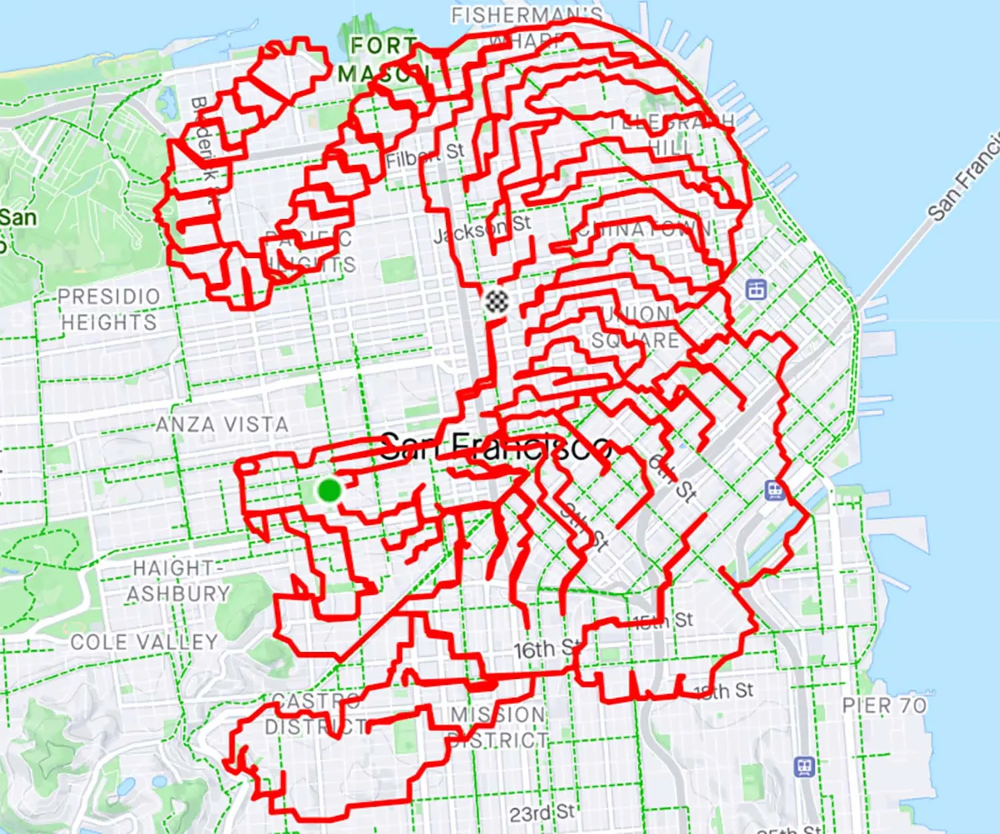

# [WIP] Strava Art Generator: Snap image to roads (map matching)

Map matching is described as a hidden Markov model where emission probability is a confidence of a point to belong a single segment, and the transition probability is presented as possibility of a point to move from one segment to another within a given time.

[https://en.wikipedia.org/wiki/Map_matching](https://en.wikipedia.org/wiki/Map_matching)

